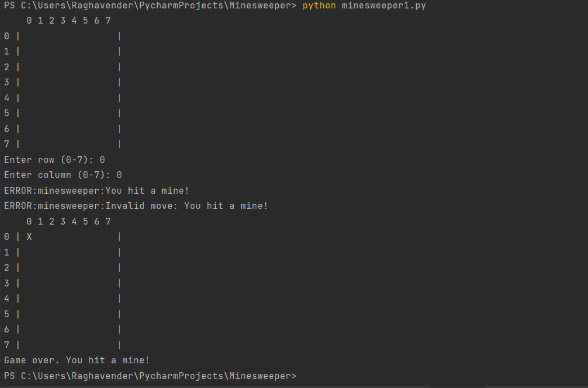
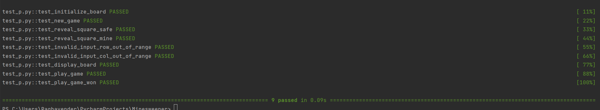
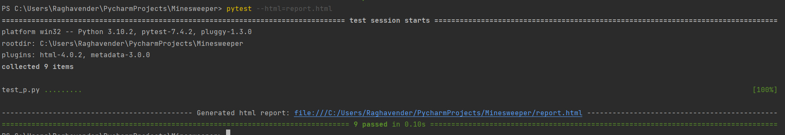
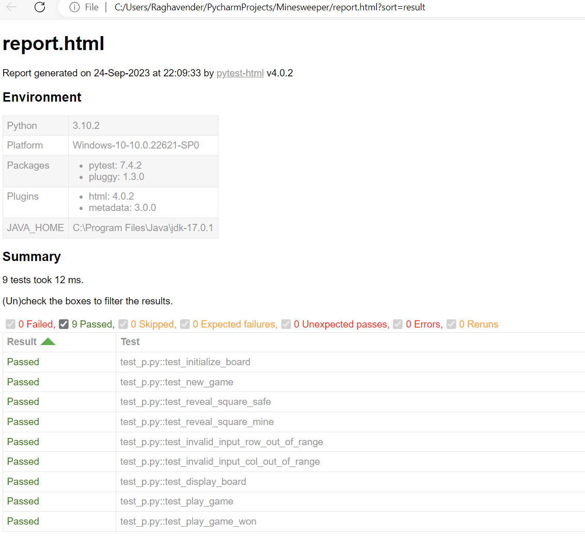

# Minesweeper project
This is python code project includes to play Minesweeper game and test the application

#Minesweeper1
This is the code to play Minesweeper game without GUI

#Minesweeper and test_p.py
This is the Pytest framework to test the features of Minesweeper game

#Installation
pip install pytest
pip install pytest-html

#Play the game
Navigate to the project directory
- Python Minesweeper1.py

#Test The Application
1 - pytest -v test_p.py

2- py.test -v -s.
3 - pytest --html=report.html

